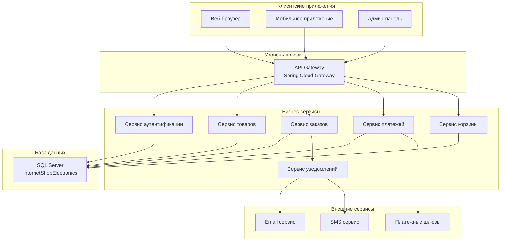
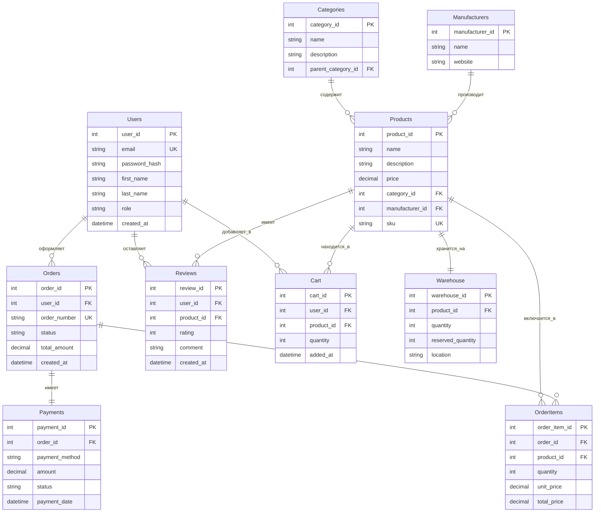
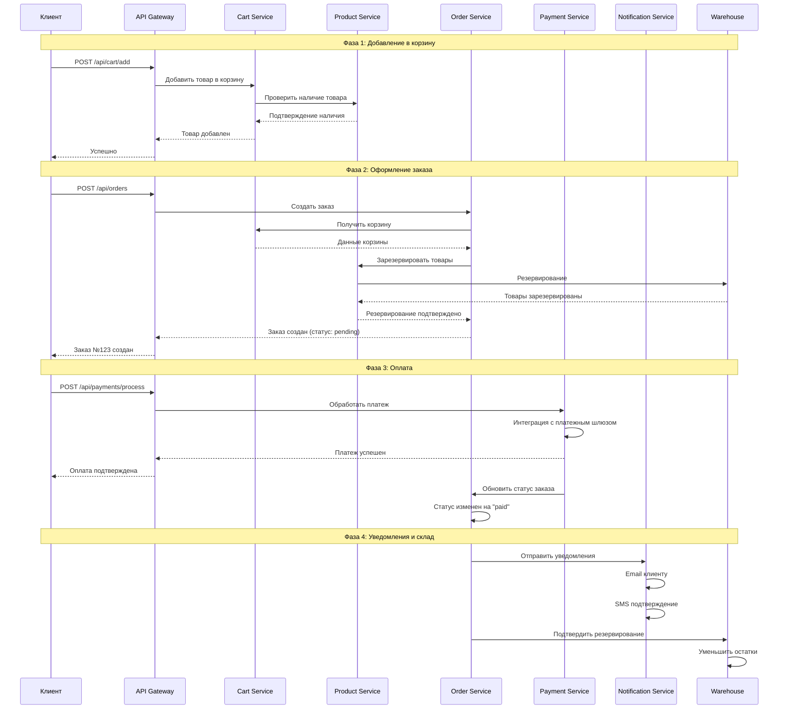

# Интернет-магазин электроники

## Описание проекта
Проект интернет-магазина электроники с микросервисной архитектурой для практической работы.

## Архитектура системы

### 3.1. Общая архитектурная схема

### 3.2. Схема базы данных (ER-диаграмма)

### 4.1. Процесс оформления заказа

## Документация

- [Техническое задание](Техническое%20задание%20(ЧСИ).docx)
- [Архитектура ИС](Архитектура%20ИС%20(1).odt) 
- [База данных](База%20Данных.docx)
- [SQL скрипты](sql/)

## Технологии

- **Backend:** Java Spring Boot, Node.js
- **Frontend:** React
- **Базы данных:** SQL Server
- **Архитектура:** Микросервисы
- **Инфраструктура:** Docker, Kubernetes

## Разработчик
Чуляков Семён Игоревич  
Группа: 11/2-РПО-24/2
